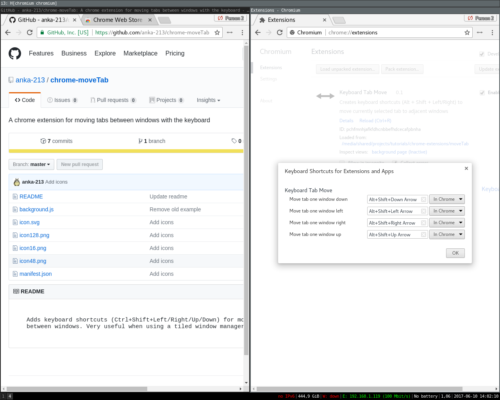
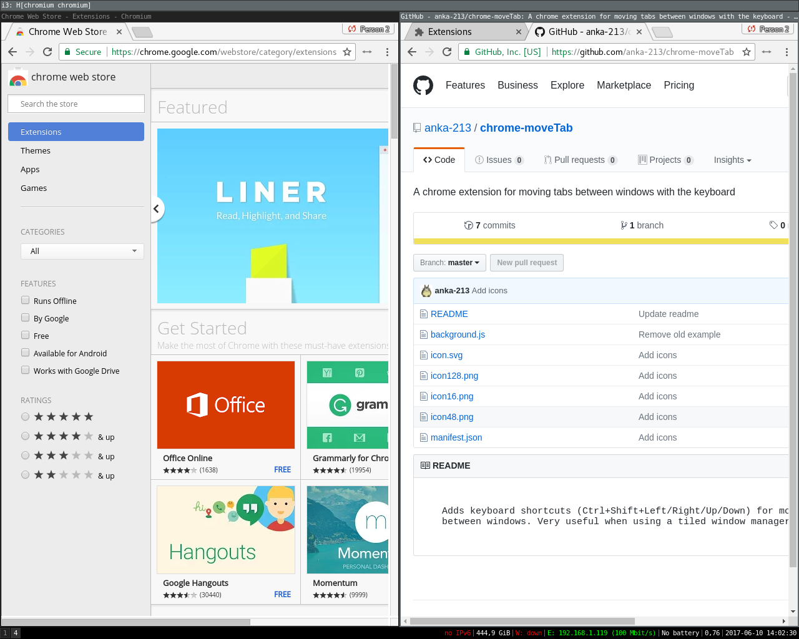

# Keyboard Tab Mover - Chrome Extension

Adds keyboard shortcuts (by default Ctrl+Left/Right/Up/Down) for moving tabs
between windows. Very useful when using a tiled window manager.

## Installation
Download from the [Chrome Webstore](https://chrome.google.com/webstore/detail/keyboard-tab-mover/gffppfcjkahcbpajekmknhfeggmcmnek)

## Screenshots

